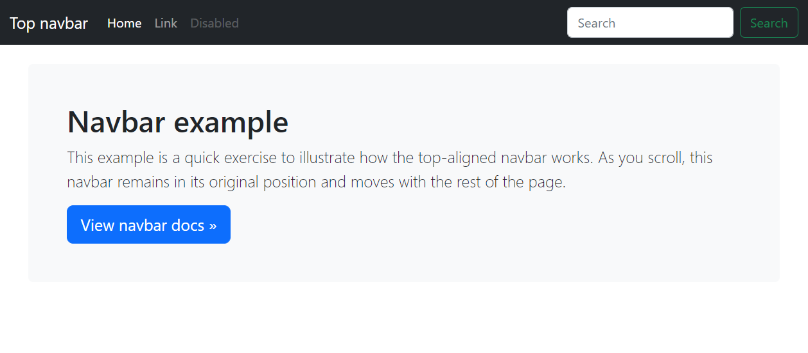
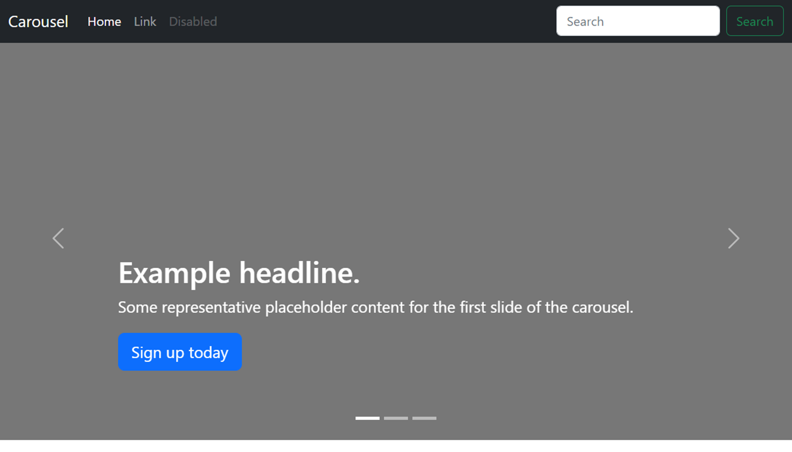
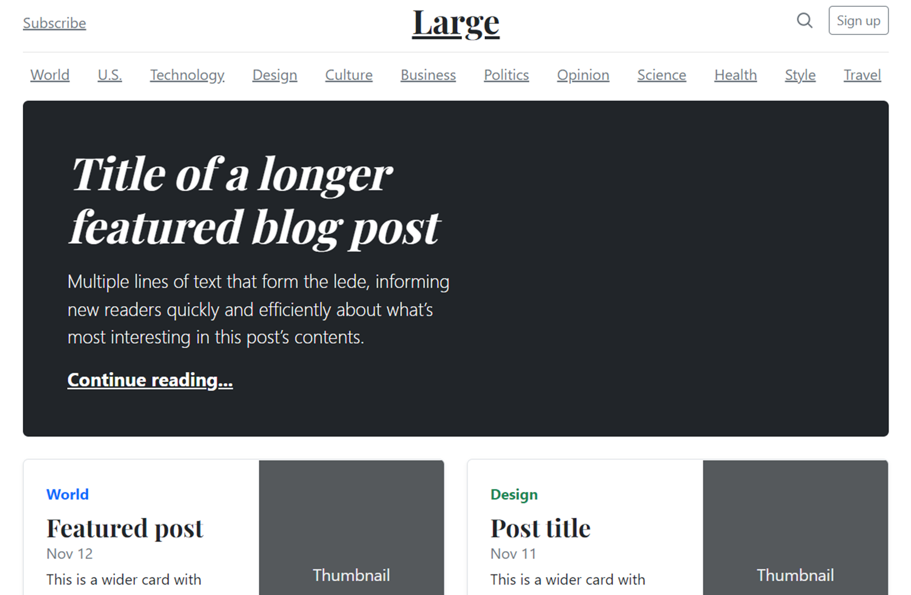
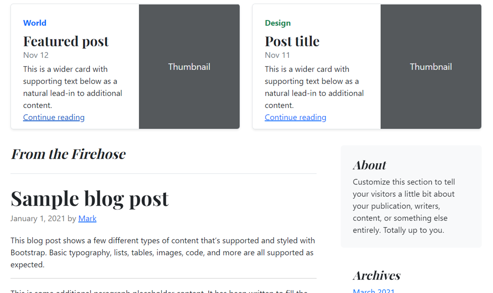
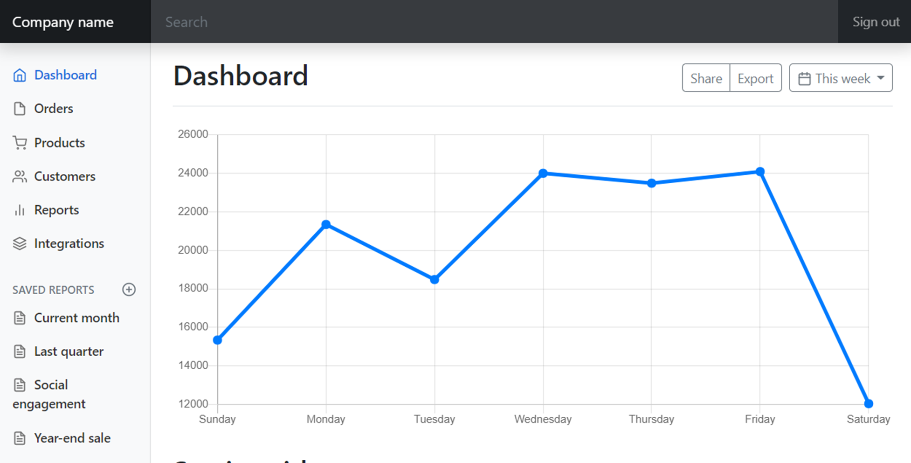

# Layout Design

As you build web pages throughout your career, you’ll notice that many pages follow similar layouts and structures. This is the outcome of many years of research into user interface design and user experience. Different companies, libraries and frameworks then adopt the resulting best practices.

Many examples of these layouts can be seen in the popular bootstrap framework. However, many other frameworks provide similar designs.

## Top Navbar Layout

Websites often have a top navbar layout to provide a set of essential anchor links to the user. These typically link to the main areas of the website, such as product pages, careers pages or contact pages. This provides the visitor to the website with a consistent navigation experience.

*Example of a top navbar layout on a web page.*

## Carousel Layout

Product-focused websites often use a large carousel on their homepage to highlight their featured products, discounts and offers. The carousel contains content items that will rotate through the carousel area at a fixed interval.

*Example of a Carousel Layout on a web page.*

## Blog Layout

The blog layout is used to feature multiple content items of differing importance. It is often seen on news websites where new articles will appear on the page each day based on current events.

*Example of a large style Blog Layout on a web page.*

The layout typically features different-sized feature areas followed by a series of article summary areas that link to full articles.

*Example of a regular style Blog Layout on a web page.*

## Dashboard Layout

Dashboard layouts are often used in enterprise software for managing various web applications. They typically feature a sidebar for navigation with the main content area containing forms for configuration or reporting data such as graphs and tables. This trendy layout provides a good user experience for business users.

*Example of a Dashboard Layout on a web page.*

## More Layouts

You can explore more of these layouts on the bootstrap examples page in the additional resources.

Consider these layouts when building websites and web applications so that you provide your audience with the best user experience possible.