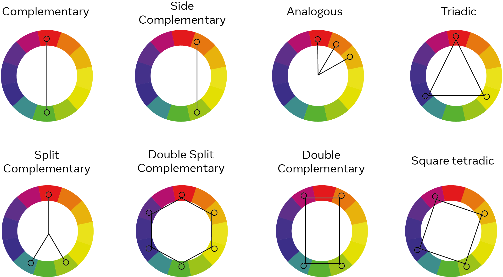

## Creating themes

The combination of colors used in the design of a website is called the color scheme. Colors are one of the most important components of any website today because it sets the tone for the viewer. For the optimal use of colors, web developers make use of color theory and color schemes.    

## Color schemes  
Fundamentally all colors are a combination of the three colors: red, yellow, and blue. These are called the primary colors. Secondary colors like orange, purple and green are a combination of two primary colors. Finally, there are six tertiary colors formed from a combination of the three primaries with secondary colors. By adding more black or more whiteyou can create lighter or darker tints of each color. All of these colors and tints make upa color wheel of 12 colors. This color wheel is the foundation for any color scheme.    

Depending on the relative positions of colors on the wheel, there are seven commonly identified color schemes according to color theory that can be used for maximum appeal. These are:     

·       Monochromatic  

·       Analogous  

·       Complementary  

·       Split complimentary  

·       Triadic   

·       Square and   

·       Rectangle  

The different combinations are represented in the image below.       

Image source:   
https://www.moving.com/tips/how-to-choose-a-color-scheme-for-your-home/

      

## Using the color schemes  
Each of the different color schemes are used with the purpose of enhancing a website. While you can pick any of the different schemes, a practiced UX designer will considerwhether a specific type of color scheme is more suitable for certain websites than others. For example, complementary colors are well-suited for websites that will have bars and charts. It also depends on several other factors such as the number of colors that you are going to need for your webpage, the topic and domain of the webpage, user demographics of the readers and so on. For example, an informational website for medical services will typically have a white background. Other than the color schemes mentioned, even achromatic themes with only black and white color can be appealing if styling and design is well presented.

## Factors to consider for themes and colors  
While color schemes serve as a guide for picking website colors, there are some factors that must be considered in the process. The user experience must be of the utmost priority as a good webpage must be able to sustain the attention of the reader withoutoverwhelming them. A good webpage will have a good balance of information and design elements. An unbalanced web design can lead to what we call as cognitive overload. Cognitive overload is when too much information or activity is presented to the user which may be detrimental to the user experience.

There is a field of research in psychology that focuses on the effects color has on the mood of a user. Nature-inspired color tones are almost universally seen to be more pleasant and add aesthetic value. As people are increasingly spending time on the internet, a good theme may make or break the appeal of a webpage. Often, it is a good idea to keep a palette of more than one color combination on hand so you can experiment with your webpage.  

A color theme on a website also plays a role in other aspects beyond the aesthetics and help in shaping the user experience of the website. A simple theme with appropriate color combinations can help a user navigate the website by creating a visual hierarchy. If for example, a user observes a specific color scheme for the subheadings, they will be able to understandwhere to look for certain information on the web page. This means you can avoid excessive design elements such as line-breaks and grids where they are not adding to the appeal of the web page.

While the experience of choosing the right colors for your website is a process of trial and error, inspiration can be drawn from a webpage that has held a personal appeal. Color theory is an important aspect of the user experience domain and plays an important role in website design so don’t be afraid to experiment with different color schemes.         